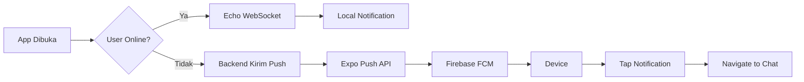

# 🔥 Firebase Push Notification Setup dengan Expo

## 📋 Overview

Menggunakan Firebase Cloud Messaging (FCM) untuk push notification yang lebih reliable daripada Expo Push Service langsung.

---

## ✅ Yang Sudah Dikonfigurasi

- ✅ `google-services.json` sudah ada
- ✅ `app.json` sudah reference `googleServicesFile`
- ✅ Package name: `com.hananfijananto.cobanativewind`
- ✅ Project ID: `sia-ugn-mobile`

---

## 🔧 Langkah Setup

### 1️⃣ Upload FCM Credentials ke Expo

Expo butuh FCM Server Key atau Service Account JSON untuk mengirim notifikasi via FCM.

#### **Opsi A: FCM Server Key (Legacy - Mudah)**

1. Buka [Firebase Console](https://console.firebase.google.com/)
2. Pilih project: **sia-ugn-mobile**
3. Klik ⚙️ **Settings** → **Project Settings**
4. Tab **Cloud Messaging**
5. Copy **Server Key** (di bagian Cloud Messaging API - Legacy)

**Upload ke Expo:**

```bash
cd D:\My-Projects-2025\pad-1-FE\FE-SIA-Global
eas credentials
```

Pilih:

- **Android**
- **production**
- **Google Service Account** → **Set up FCM**
- Paste **Server Key**

#### **Opsi B: Service Account JSON (Recommended - Modern)**

1. Buka [Firebase Console](https://console.firebase.google.com/)
2. Pilih project: **sia-ugn-mobile**
3. Klik ⚙️ **Settings** → **Project Settings**
4. Tab **Service Accounts**
5. Klik **Generate New Private Key**
6. Download file JSON

**Upload ke Expo:**

```bash
eas credentials
```

Pilih:

- **Android**
- **production**
- **Google Service Account**
- **Upload service account JSON**
- Select downloaded JSON file

---

### 2️⃣ Enable FCM API di Google Cloud

FCM API harus diaktifkan di Google Cloud Console:

1. Buka [Google Cloud Console](https://console.cloud.google.com/)
2. Pilih project: **sia-ugn-mobile** (project number: 350055954852)
3. Search "Firebase Cloud Messaging API"
4. Klik **Enable**

**Atau via link langsung:**

```
https://console.cloud.google.com/apis/library/fcm.googleapis.com?project=350055954852
```

---

### 3️⃣ Verifikasi app.json

Sudah benar ✅:

```json
{
  "android": {
    "googleServicesFile": "./google-services.json",
    "package": "com.hananfijananto.cobanativewind"
  },
  "plugins": [
    [
      "expo-notifications",
      {
        "icon": "./assets/images/logo-ugn.png",
        "color": "#015023"
      }
    ]
  ]
}
```

---

### 4️⃣ Rebuild Aplikasi

Setelah upload FCM credentials:

```bash
eas build --platform android --profile production
```

Build baru akan menggunakan FCM untuk push notifications.

---

## 📱 Cara Kerja

### **Frontend (Sudah Dikonfigurasi)**

```typescript
// notificationService.ts sudah menggunakan:
const token = await Notifications.getExpoPushTokenAsync({
  projectId: "e1d2b90f-3cad-4f8a-bb98-ecff8f68a39f",
});

// Token ini akan di-route ke FCM otomatis oleh Expo
```

### **Backend Options**

#### **Opsi 1: Via Expo Push API (Recommended - Mudah)**

Backend tetap kirim ke Expo, Expo akan route ke FCM:

```php
Http::post('https://exp.host/--/api/v2/push/send', [
    'to' => $expoToken, // ExponentPushToken[xxx]
    'title' => 'Pesan Baru',
    'body' => 'Halo!',
    'data' => [
        'type' => 'chat',
        'id_conversation' => 123
    ]
]);
```

Expo akan otomatis route ke FCM karena sudah upload credentials.

#### **Opsi 2: Langsung ke FCM (Advanced)**

Backend kirim langsung ke FCM (perlu FCM device token):

```php
use Kreait\Firebase\Factory;
use Kreait\Firebase\Messaging\CloudMessage;

$factory = (new Factory)->withServiceAccount('firebase-credentials.json');
$messaging = $factory->createMessaging();

$message = CloudMessage::withTarget('token', $fcmToken)
    ->withNotification([
        'title' => 'Pesan Baru',
        'body' => 'Halo!',
    ])
    ->withData([
        'type' => 'chat',
        'id_conversation' => '123'
    ]);

$messaging->send($message);
```

**Untuk opsi ini, frontend harus kirim FCM token (bukan Expo token).**

---

## 🧪 Testing

### Test 1: Build dan Install

```bash
# Build dengan FCM
eas build --platform android --profile production

# Install APK di device
# Tutup aplikasi
```

### Test 2: Kirim Test Notification dari Firebase Console

1. Buka [Firebase Console](https://console.firebase.google.com/)
2. **Engage** → **Cloud Messaging**
3. **Send your first message**
4. Title: "Test Push"
5. Body: "Halo dari Firebase!"
6. **Send test message**
7. Paste **FCM device token** (dari log app)
8. **Test**

### Test 3: Kirim dari Backend

```bash
curl -X POST https://exp.host/--/api/v2/push/send \
  -H "Content-Type: application/json" \
  -d '{
    "to": "ExponentPushToken[xxxxx]",
    "title": "Test dari Backend",
    "body": "Aplikasi ditutup, harusnya muncul!",
    "data": {
      "type": "chat",
      "id_conversation": 1
    }
  }'
```

---

## 🔍 Troubleshooting

### ❌ Notifikasi tidak muncul saat app ditutup

**Cek:**

1. FCM credentials sudah diupload ke Expo?

   ```bash
   eas credentials
   # Cek apakah ada FCM key
   ```

2. FCM API sudah enabled di Google Cloud?

   ```
   https://console.cloud.google.com/apis/library/fcm.googleapis.com
   ```

3. Build menggunakan google-services.json yang benar?

   ```bash
   # Cek di app.json
   "googleServicesFile": "./google-services.json"
   ```

4. Device sudah install APK build terbaru?

### ❌ Error: "FCM token not found"

Ini normal untuk emulator. **Test di device fisik.**

### ❌ Error: "SENDER_ID_MISMATCH"

- Package name di `app.json` harus sama dengan Firebase:
  ```json
  "package": "com.hananfijananto.cobanativewind"
  ```
- Rebuild aplikasi setelah ubah package name

---

## 📊 Monitoring

### Cek Delivery Status

```bash
# Ambil receipt dari Expo
curl -X POST https://exp.host/--/api/v2/push/getReceipts \
  -H "Content-Type: application/json" \
  -d '{
    "ids": ["notification-id-dari-send-response"]
  }'
```

**Response:**

```json
{
  "data": {
    "notification-id": {
      "status": "ok" // atau "error"
    }
  }
}
```

### Firebase Console Analytics

1. Buka [Firebase Console](https://console.firebase.google.com/)
2. **Engage** → **Cloud Messaging**
3. Lihat statistik delivery

---

## 🎯 Ringkasan Workflow



---

## ✅ Checklist

- [ ] Enable FCM API di Google Cloud Console
- [ ] Upload FCM Server Key/Service Account ke Expo
- [ ] Rebuild aplikasi: `eas build`
- [ ] Install APK di device fisik
- [ ] Test: Tutup app → Kirim notifikasi → Harusnya muncul
- [ ] Test: Tap notifikasi → Navigate ke chat room
- [ ] Backend sudah kirim push notification untuk user offline

---

## 📚 Referensi

- [Expo Push Notifications with FCM](https://docs.expo.dev/push-notifications/fcm-credentials/)
- [Firebase Cloud Messaging](https://firebase.google.com/docs/cloud-messaging)
- [EAS Credentials](https://docs.expo.dev/app-signing/app-credentials/)

---

**Status**: 🟡 Setup FCM credentials → Rebuild → Test  
**Next**: Upload FCM key ke Expo, rebuild APK
